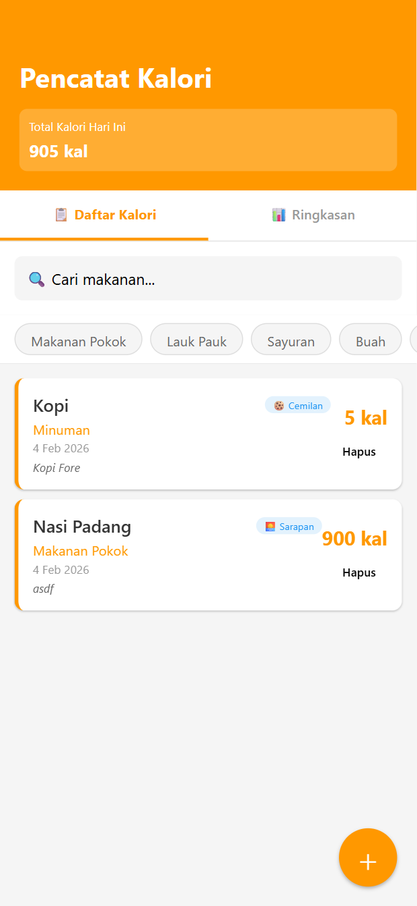
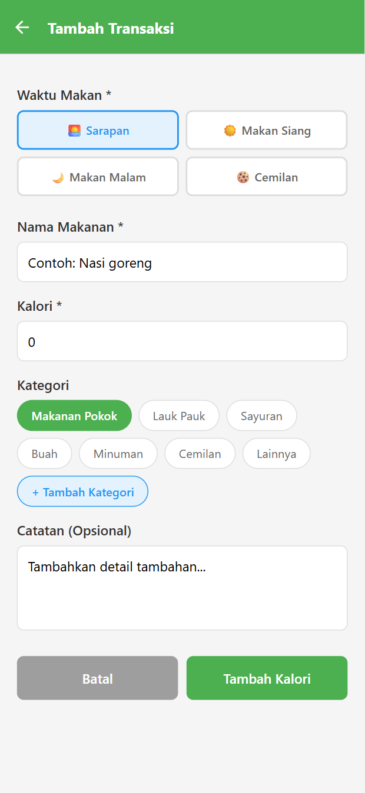

📌 **PENGUMUMAN UAS PRAKTIK**
*Mata Kuliah: Pemrograman Mobile (React Native)*
*Kelas Gabungan: Sistem Informasi, Teknik Informatika, dan Teknologi Informasi*

Ujian Akhir Semester (UAS) Praktik dilaksanakan dengan ketentuan berikut:

🗓 **Tanggal:** 5 Februari 2026

⏰ **Waktu mulai:** 09.00 WIB

🏠 **Sistem pengerjaan:**
Dikerjakan dari rumah masing-masing (**Work From Home**) secara **mandiri**, tanpa bantuan siapa pun, sesuai dengan **kemampuan Anda masing-masing** selama perkuliahan.

📥 **Deadline pengumpulan:**
🕚 Jumat, 6 Februari 2026 pukul 23.00 WIB

---

### 🎯 Deskripsi Tugas

Berdasarkan referensi aplikasi berikut:
👉 [Expense Tracker App](./slides/expense-tracker-app.md)

Buatlah **aplikasi pencatat kalori sederhana menggunakan React Native** dengan fitur dan tampilan seperti contoh berikut:

---

### 🛠 Ketentuan Teknis

✅ Menggunakan **React Native**
✅ Penyimpanan data menggunakan **Local Storage**
✅ **Pengerjaan individu**
✅ Source code diupload dalam bentuk **file ZIP** ke Google Form
❌ Jangan sertakan folder `node_modules`

[👉 Link Google Form Pengumpulan Tugas UAS Praktik](https://forms.gle/W4SvkuT6w8w9hLN18)

---

### ⚠ Etika Akademik

Mahasiswa diharapkan tidak melakukan kecurangan dalam bentuk apa pun. Jika terbukti melakukan kecurangan, maka nilai UAS akan dibatalkan dan dinyatakan **tidak lulus**.

> “**Kurang cerdas dapat diperbaiki dengan belajar, kurang cakap dapat dihilangkan dengan pengalaman.  Namun tidak jujur sulit diperbaiki.**” — *Mohammad Hatta*

> **“Tidak ada arti menjadi yang terbaik jika dicapai tanpa kejujuran dan tidak bisa dipertanggung jawabkan.”**

